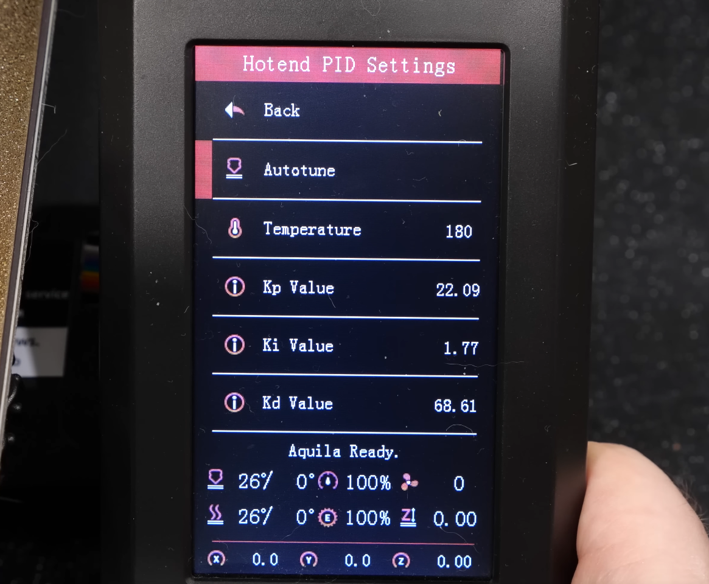
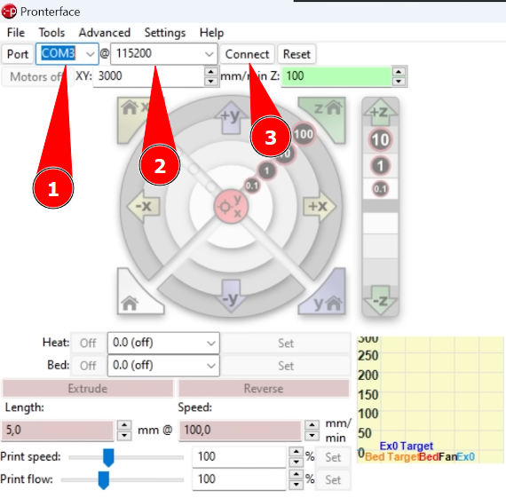

# Калибровка PID

<iframe width="900" height="506" src="https://www.youtube.com/embed/doenKnVk0Ec?start=935" title="YouTube video player" frameborder="0" allow="accelerometer; autoplay; clipboard-write; encrypted-media; gyroscope; picture-in-picture; web-share" allowfullscreen></iframe>

Для управления температурой хотенда и стола, если это включено в прошивке, используется PID регулирование. Чтобы управление осуществлялось корректно, нужно подобрать коэффициенты Kp, Ki и Kd. Принтер умеет делать это самостоятельно, достаточно дать ему команду.

## Калибровка в прошивке Marlin

### Калибровка из меню принтера



В соверменных конфигурациях прошивок часто можно найти калибровку PID прямо в меню принтера. Если она там есть, алгоритм следующий: 

1. Поднимите печатающую голову хотя бы на пару миллиметров над столом, чтобы не повредить покрытие
2. Запустите калибровку PID для хотенда при температуре 250 градусов
3. Ждите остывания хотенда до 150 градусов или ниже
4. Запустите калибровку PID для стола при температуре 100 градусов
5. Ждите остывания стола до 50 градусов или ниже
6. Сохраните настройки

### Калиброка с помощью компьютера

Если в меню принтера нет ни одного упоминания PID, придётся подключить принтер к компьютеру для этой калибровки. Обычно кабель для этого кладут в комплект к принтеру, так что проблем быть не должно.

#### Подключение принтера к компьютеру

Для общения с принтером понадобится программа Pronterface, она же Printrun. Скачать её можно [здесь](https://github.com/kliment/Printrun/releases).

Для подключения нужно выбрать COM-порт (1), бодрейт (2) и нажать кнопку `connect` (3).



Порт найти очень просто: при отключенном принтере смотрим, какие порты в списке есть. Потом подключаем принтер и смотрим, какой появился.

Единственная частая проблема с портом - отсутствие драйверов на компьютере. Практически для всех плат принтеров подходит под ch340. Скачать его можно [здесь](http://wiki.amperka.ru/articles:driver-ch340).

Бодрейт у всех принтеров либо 115200, либо 250000 с плюс-минус одинаковой частотой. Так что попробуйте один, если в консоли пишет `rubbish reply`, то другой. При успешном подключении должно быть написано коннектед и под панелью инструментов должны корректно отобразиться температуры хотэнда и стола.

Для дополнительной проверки можно запросить настройки прошивки в виде списка gcode'ов
``` { .yaml .copy }
M503
```

#### Калибровка

Далее этапы совпадают с калибровкой через меню:

- Поднимите печатающую голову хотя бы на пару миллиметров над столом, чтобы не повредить покрытие;
- Запустите калибровку PID для хотенда при температуре 250 градусов:
``` { .yaml .copy }
M303 E0 S250 C8 U
```
- Ждите остывания хотенда до 150 градусов или ниже;
- Запустите калибровку PID для стола при температуре 100 градусов:
``` { .yaml .copy }
M303 E-1 S100 C8 U
```
- Ждите остывания стола до 50 градусов или ниже;
- Сохраните настройки:
``` { .yaml .copy }
M500
```

!!! note "Если принтер не реагирует на команду калибровки PID стола, то он контролируется более простым алгоритмом bang-bang. Прогрейте стол до 80-100 градусов и посмотрите, насколько сильно колеблется его температура. Если плюс-минус градус, ничего делать не нужно. Если больше, ищите прошивку с влюченным PID для стола."

## Калибровка в прошивке Klipper

То же самое, что и в Marlin, только команды немного другие:

- Поднимите печатающую голову хотя бы на пару миллиметров над столом, чтобы не повредить покрытие;
- Запустите калибровку PID для хотенда при температуре 250 градусов:
``` { .yaml .copy }
PID_CALIBRATE HEATER=extruder TARGET=250
```
- Ждите остывания хотенда до 150 градусов или ниже;
- Запустите калибровку PID для стола при температуре 100 градусов:
``` { .yaml .copy }
PID_CALIBRATE HEATER=heater_bed TARGET=100
```
- Ждите остывания стола до 50 градусов или ниже;
- Сохраните настройки:
``` { .yaml .copy }
SAVE_CONFIG
```
## FAQ

### После калибровки температура не поддерживается корректно

| Причина | Решение |
|:--------:|:-------:|
| Вы не сохранили значения после калибровки | Проведите калибровку заново и не забудьте сохранить настройки |
| На нагревательном блоке нет силиконового носка | Купите и наденьте носок |
| Обдув модели вашего принтера достаточно мощный, чтобы оказывать значительное влияние на поддержание температуры | Проведите повторную калибровку с включенным примерно на 60% обдувом |
