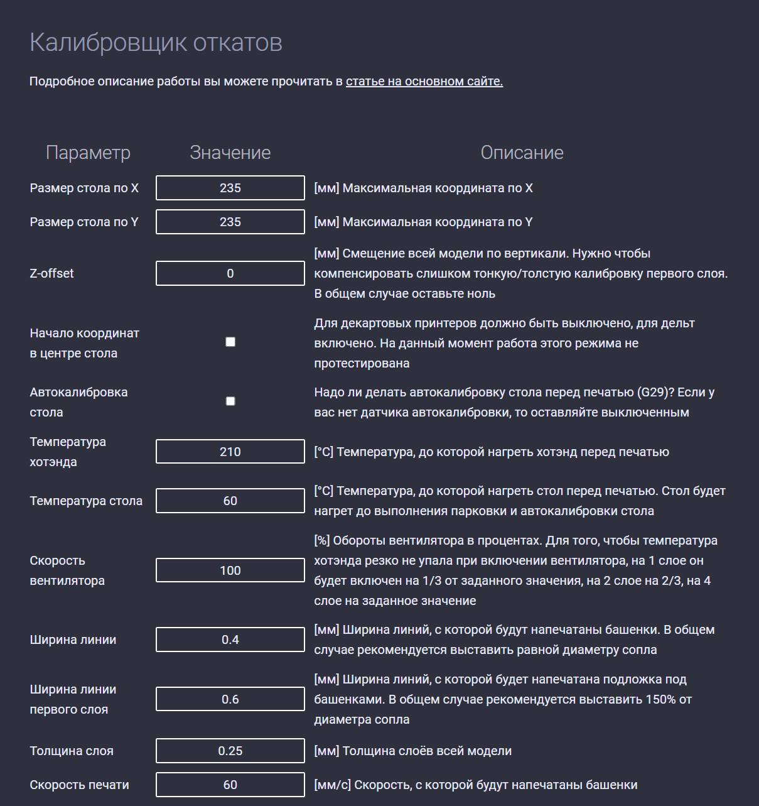
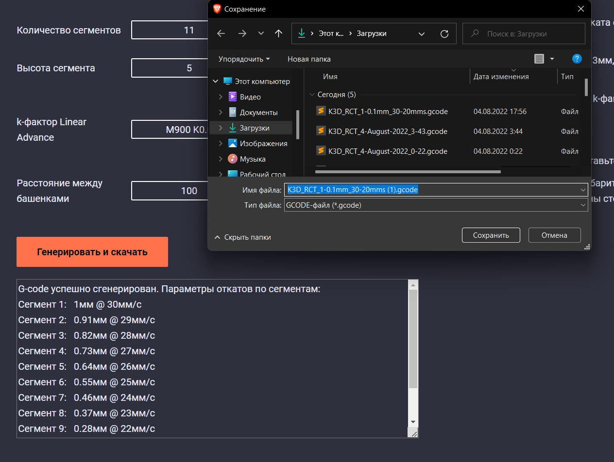
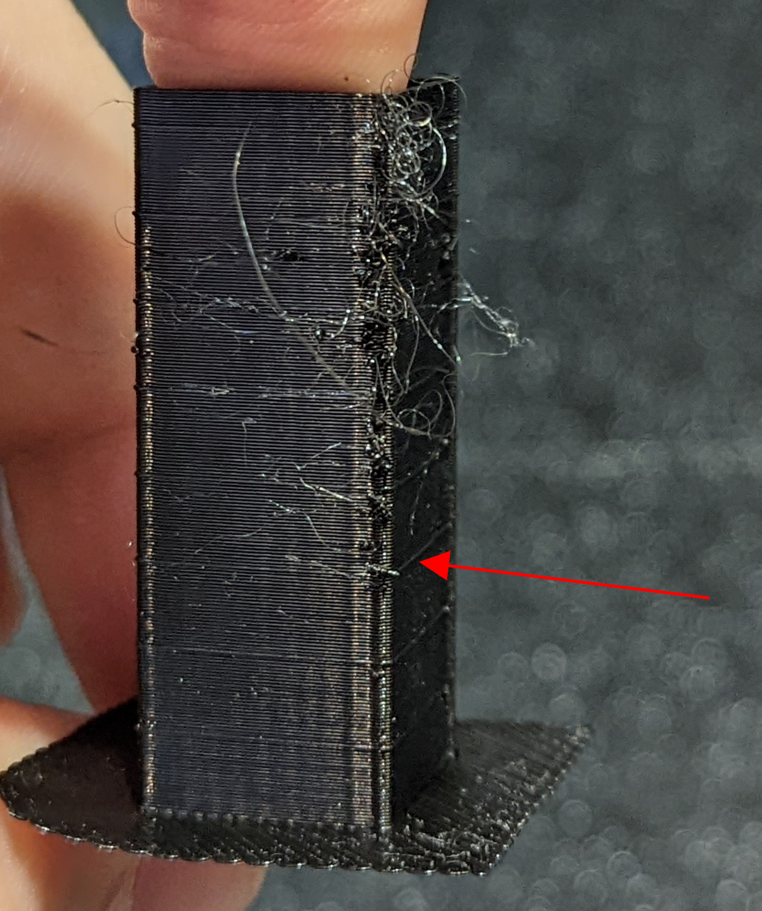
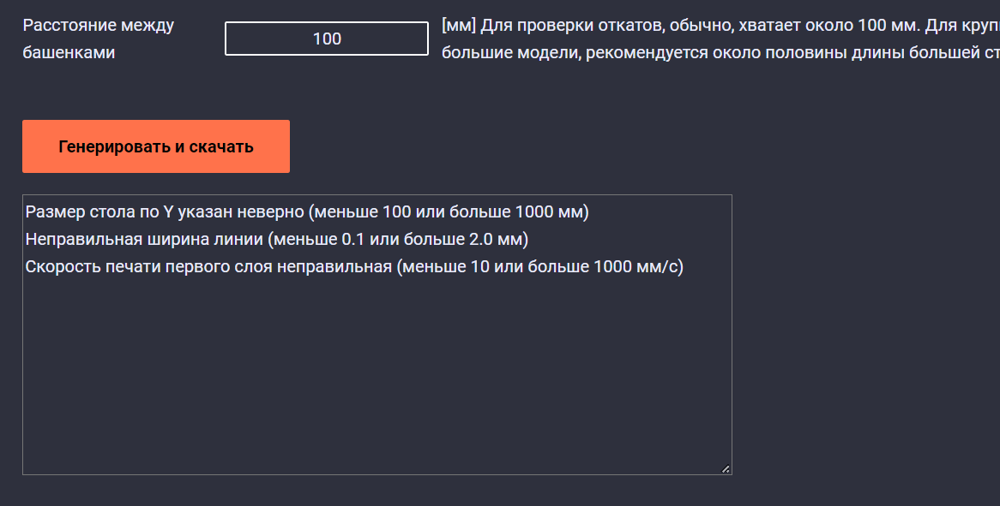

# K3D Калибровщик откатов

## Описание

[K3D Калибровщик откатов](./rct.html) генерирует G-code для подбора значения длины и/или скорости отката экструдера FDM 3D принтера. Используется самая распространенная методика печати двух башенок со ступенчато изменяющимися длиной и/или скоростью отката по высоте. Таким образом за 1 печать можно проверить сразу несколько значений, что сокращает время калибровки.

## Плюсы калибратора откатов K3D

- Наиболее приближенные к реальной печати условия проверки откатов. В частности, между каждым откатом печатается линия длиной около 120мм, что исключает взаимовлияние проверяемых значений друг на друга;

- Регулируемая длина перемещений позволяет еще больше приблизить условия тестирования к реальной печати на любом принтере;

- Проверяется не только откат от одной точки до другой, но и откат при смене слоя;

- Благодаря печати плота на первом слое, башенки достаточно устойчивы для проверки откатов на любых материалах, используемых в FDM 3D печати;

- Перед печатью башенок делается прочистка экструдера, что увеличивает шанс успешной печати без вмешательства пользователя (без ручной прочистки перед печатью);

- Сегменты с разными значениями длины и/или скорости отката отделены выпирающими слоями, что упрощает съем данных с распечатанной модели;

- В общем случае тест занимает достаточно малое количество времени;

- Калибратор доступен в виде веб-приложения, то есть может быть использован без предварительной установки;

- Нет требований к конфигурации прошивки, работает почти со всеми FDM 3D принтерами.

## Как пользоваться калибратором

### Настройки

1. Заходите [на страницу калибратора](./rct.html);
2. Перед вами будет список параметров, которые надо указать соответственно вашим обычным настройкам печати из слайсера;

1. Слева от каждого параметра есть его название, которое соответствует названию с большинстве слайсеров;
2. Справа есть подробное описание как параметр работает и какие значения стоит указывать;
3. Все значения стоит указывать цифрами, в качестве разделителя можно использовать как точку, так и запятую;
4. Введенные значения сохраняются в памяти браузера, так что можете не бояться закрыть или обновить страницу;
   3. Нажимаете на кнопку `Генерировать и скачать`

### Если параметры в допустимых диапазонах

Если введенные вами значения параметров соответствуют допустимым диапазонам, то выведется окно скачивания файла и информационное окно внизу страницы. 

Файл следует сохранить и распечатать на принтере привычным для вас методом. Перед печатью рекомендуется перезагрузить принтер чтобы избежать конфликта с ранее напечатанными файлами. Также рекомендуется просушить пластик, чтобы избежать ложных результатов.

В информационном окне внизу страницы будут выведены параметры откатов для каждого сегмента. Сегменты нумеруются снизу, то есть самый нижний - сегмент 1, второй снизу - сегмент 2 и так далее. Не обязательно сохранять куда-то эти значения, так как информация о значениях на сегментах также сохраняется внутри G-code файла. Вы можете открыть его любым текстовым редактором, например, [Notepad++](https://notepad-plus-plus.org/), и посмотреть значения там. Также информация о начальных и конечных длинах и скоростях откатов за сегмент будет сохранена в названии файла.

Посмотрите на распечатанные башенки. Если диапазон проверяемых значений подобран правильно, то снизу у вас должны быть сегменты, распечатанные без дефектов, а сверху сегменты, на которых будут оставаться кусочки из вытекшего за время перемещения пластика. На фото модели выше дефекты начинаются с 4 сегмента, это значит что значения параметров длины и скорости откатов для 3 сегмента подходят и являются оптимальными.

Если все сегменты отпечатаны без дефектов, то диапазон проверяемых значений стоит сместить в меньшую сторону. Например, если вы проверяли длину откатов от 5 до 3мм, и дефектов нигде нет, то стоит проверить диапазон от 3 до 1мм.

Если все сегменты имеют дефекты, связанные с вытекающим во время перемещения пластиком, то стоит проверить, что тестируемый пластик просушен и что для него выставлены оптимальные температуры. Если с этим проблем нет, значит надо сместить тестируемый дипазон в сторону больших значений.

### Если параметры выходят из допустимых диапазонов

Если указанные вами параметры выходят из допустимых диапазонов, то окна для скачивания файла выведено не будет. В информационном окне будет выведено какие параметры выходят за допустимые пределы. Исправьте эти значения и попробуйте снова.

## Если что-то не работает

### Не появляется кнопки "генерировать и скачать"

Кнопка Генерировать и скачать появляется после того, как браузер загружает основной исполняемый файл программы. Обычно на это уходит менее 20 секунд, но в редких случаях может уйти больше времени. 

Если в течение 2 минут кнопка не появилась, то попробуйте перезагрузить страницу с помощью сочетания клавиш `ctrl + F5`.

Если после обновления страницы всё равно не появляется кнопки, то, скорее всего, ваш браузер не поддерживает webassembly. В таком случае рекомендуется установить более современный браузер (Chrome, Firefox, Safari, Edge и т.д. последних версий).

### При нажатии кнопки "генерировать и скачать" ничего не происходит

Скорее всего это значит, что вы ввели недопустимые значения параметров и программа вылетела с ошибкой. Такое может быть если вводить буквы вместо цифр, например. В этом случае обновите страницу с помощью сочетаний клавиш `ctrl + F5`, проверьте все значения и попробуйте еще раз.

### Ошибка "move exceeds maximum extrusion"

Эта ошибка возникает в прошивке klipper и решается внесением строчки `max_extrude_cross_section: 999999` в раздел `extruder` в конфигурации.

Это отключит защиту от выдавливания большого количества пластика на маленьких перемещениях. Отключение этой защиты не приводит ни к каким негативным последствиям, то есть у вас не возникнет дефектов печати, не возникнет ситуаций, опасных для механики принтера и так далее.

В целом, работа этой защиты, скорее всего, забагована. На это указывает несколько вещей:

- Она иногда срабатывает и на g-code из Cura или Prusaslicer, которые после отключения защиты печатаются полностью нормально;
- Тот же g-code из калибратора после отключения защиты печатается нормально, без дефектов;
- Ручной поиск где klipper насчитал такую экструзию на данный момент безуспешен. Ни одна из линий в g-code не имеет такой площади сечения, но klipper её где-то находит;
- На других прошивках эти "проблемные" g-code файлы печатаются так же без ошибок и дефектов.

### Если ничего не помогает

В случае, если ничего не помогает, то рекомендуется попробовать в другом браузере или на другом устройстве, например. на телефоне. Если и это не поможет, то обратитесь [в общий чат K3D](https://t.me/K_3_D) с описанием проблемы и тегом @dmitry_sorkin.

## Изменения в версиях

### v1.1

- Добавлены параметры откатов по сегментам в начало G-code файла;
- Упрощен вывод ошибок (убрано ненужное)
- Добавлена команда M82 (абсолютная экструзия) в начальный скрипт печати

### v1.2

- Теперь в качестве разделителя в дробных числах поддерживается не только точка, но и запятая;

- Увеличен диапазон допустимых скоростей откатов до 150мм/с;

- Диапазон допустимой высоты сегмента изменен на [0.5-50] мм;

- Исправлен двойной вывод ошибки;

- Конечный G-code печати изменен и теперь должен работать на всех принтерах, включая дельты;

- Порядок сегментов в информационном сообщении инвертирован чтобы совпадать с порядком печати сегментов.

### v1.3

- Исправлен порядок нагрева хотэнда и стола;

- Прочистка хотэнда теперь осуществляется в две линии.

### v1.4

В этом обновлении добавлено несколько оптимизаций печати, которые призваны приблизить работу генератора к слайсерам.

- Периметры в башне теперь печатаются так, как их генерируют слайсеры (теперь два отдельных прямоугольника, раньше была спираль);

- Изменен порядок печати башен. Раньше: `левая -> правая -> левая -> правая`. Теперь: `левая -> правая -> правая -> левая`;

- Шов на правой башенке теперь зеркален шву на левой;

- Теперь после печати голова не только поднимается на 5мм, но еще и отходит к центру стола.

### v1.5

- Исправлена работа Z-offset;
- Движение к началу печати теперь осуществляется в два этапа: сначала поднимается ось Z, потом идёт движение в плоскости XY. Это позволяет избежать столкновения сопла со столом на принтерах, где положение при парковке ниже поверхности стола;
- В прошлой версии неправильно считались координаты периметров башенок, из-за чего те пересекались на 50%. Это вызывало переэкструзию и гипертрофированный шов. В новой версии расстояние между периметрами считается так, чтобы те пересекались на 10%;
- Исправлен отвод сопла к центру области печати.

### v1.6

- Добавлена поддержка английского языка;
- Добавлена настройка потока;
- Добавлена кнопка сброса параметров к стандартным значениям;
- Ввод команды на установку k-фактора LA/PA теперь зависит от типа прошивки;
- Добавлена возможность менять стартовый и конечный G-код.

### v1.7

- Динамическая генерация списка проверяемых значений при изменении любого параметра, связаннго с ними.