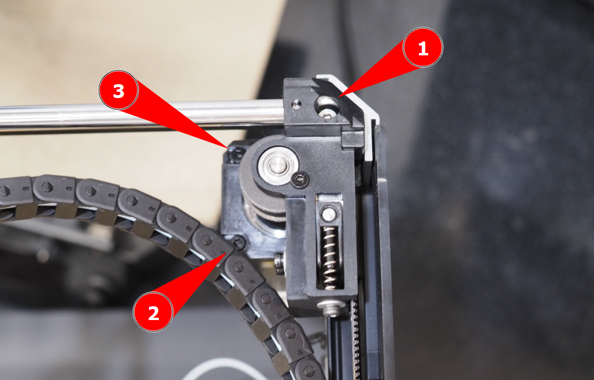

---
hide:
    - navigation
title: Доработки Creality K1
---

# Creality K1

## Обзор

<iframe width="900" height="506" src="https://www.youtube.com/embed/Qdcv0IBwyc4?si=PZZ8A_DzOGeV1Bsf" title="YouTube video player" frameborder="0" allow="accelerometer; autoplay; clipboard-write; encrypted-media; gyroscope; picture-in-picture; web-share" allowfullscreen></iframe>

Один из самых быстрых серийных принтеров. При этом полностью закрытая камера и относительно небольшие габариты. Экструдер способен стабильно печатать средне-мягкими эластомерами, плюс производительный хотэнд и мощное охлаждение. Электроника хорошая, есть все влияющие на характеристики принтера алгоритмы + удобный веб-интерфейс. В общем, принтер по соотношению цена\характеристики очень хорош...

Но всё описанное ранее становится правдой только если приложить к принтеру руки. В полном стоке у него может быть криво собрана механика или не протянуты соединения, из-за чего неправильно настроится Input Shaping[^1] и принтер может не быть таким быстрым. Система охлаждения сделана из не термостойкого материала и оплывает при печати с температурой стола выше 100°C. Низкокачественные шкивы вызывают рябь[^3]. Прошивка закрыта и криво сконфигурирована. В общем, в стоке принтер не очень и пользоваться им неприятно.

Почему я тогда его советую? Потому что все его дефекты исправляются за 1-2 вечера несложной работы + ~800 рублей. И, самое главное, исправлять эти дефекты в целом имеет смысл так как после этого характеристики становятся реально крутые, на уровне продвинутых самосборов с бюджетом в 2-3 раза выше. Иными словами, эта модель принтера - вариант для рукастых людей, желающих получить максимальные характеристики за относительно небольшие деньги.

[:material-youtube: Подробнее в видео на YouTube](https://youtu.be/Qdcv0IBwyc4?si=wDc-_pAG54-aqi6N)

## Доводка принтера

### Замена шкивов и переборка механики

!!! note "Для версии K1C не нужно, там в стоке уже всё сделано"

В стоке у принтера стоят очень низкокачественные шкивы большого диаметра. Из-за них возникает рябь - дефект в виде вертикальных полос с шагом 2мм на модели. У некоторых амплитуда ряби послабее и их устраивает качество печати, у некоторых сильнее, но она есть у всех. Учитывая стоимость нормальных шкивов менее 10$, не имеет смысла оставлять штатные.

Также на некотором проценте принтеров механика может быть плохо собрана с завода. Например, не протянутые соединения могут вызывать люфты, из-за которых будет неправильно калиброваться Input Shaping[^1] и на деталях будет эхо[^2]. При замене шкивов придётся довольно много всего разобрать. Просто собирая всё обратно выравнивая всё кривое и протягивая всё не протянутое можно решить и эту проблему.

Порядок действий:

а. Купить 2 шкива 20 зубов под 6-10мм ремень с отверстием 5мм: [:material-shopping:](https://alli.pub/6u3lv1?erid=2SDnjeAACsA) и съёмник для подшипников: [:material-shopping:](https://www.vseinstrumenti.ru/product/peredvizhnoj-2-h-lapyj-semnik-s-fiksatorom-avtodelo-75-mm-f19-35-mm-41875-11632-1167274/) ;

б. Отсоединить разъёмы бокового вентилятора и камеры, после чего снять боковые панели;

в. Снять переднюю дверцу и аккуратно отклеить декоративные накладки справа и слева под ней;

г. Отогнуть заднюю панель и открутить винты сверху в углах под ней (1);
{ .annotate }

1. 

д. Открутить винты во всех других углах сверху. После этого портал должен легко сняться (1);
{ .annotate }

1. 

е. Максимально ослабить натяжители ремней в задней части принтера;

ж. Снять систему охлаждения с печатающей головы;

з. Открутить и отодвинуть в сторону переходные платы с вентилятором;

и.  Открутить крепления ремней от печатающей головы (1);
{ .annotate }

1. 

к. Открутить винты крепления моторов (по 3 винта на мотор) и снять их вниз (1);
{ .annotate }

1. 

л. Сделать фото на какой высоте находился шкив на каком моторе, после чего снять шкивы с помощью съёмника;

м. Надеть новые шкивы чтобы центр зубчатой части плюс-минус совпадал с центром зубчатой части стоковых шкивов. Крепежные винты сильно не затягивать на этом этапе;

н. Установить моторы обратно. Если шкив упирается в подшипник, то сместить его так, чтобы не упирался. Зазор можно выставить банковской карточкой или чем-нибудь подобным;

о. Закрепить ремни к печатающей голове и, не натягивая их сильно, проверить, что они нормально встают на шкив. Не обязательно, чтобы ремень ходил прямо по центру шкива, главное чтобы не упирался в бортик сильно;

п. Собрать всё в обратном порядке протягивая соединения и выравнивая всё криво стоящее. При протяжке соединений обратите внимание, что многие винты закручиваются в пластик, и прям сильно их тянуть нельзя. Если сорвёте резьбу, то придётся снимать пластиковую деталь и вплавлять туда резьбовую втулку;

р. Еще раз всё проверить, затянуть винты шкивов и натянуть ремни. После этого еще раз всё проверить :)

с. В прошивке изменить разрешение осей XY (RD=40мм) + [откалибровать чувствительность sensorless homing](https://www.klipper3d.org/TMC_Drivers.html#tuning) + откалибровать Input Shaping заново. Pressure Advance, шаги экструдера и т.д. калибровать не надо.

### Исправление софта

В стоке прошивка имеет ужасный и крайне задушенный по функциональности веб-интерфейс + не может принимать файлы на печать напрямую из слайсера. Чтобы это исправить надо [установить прошивку с root доступом](https://guilouz.github.io/Creality-K1-Series/firmwares/install-and-update-rooted-firmware/). 

После этого на 4408 порту принтера появится веб-интерфейс Fluidd, через который вы и будете управлять принтером. Зайти на него можно приписав порт к IP-адресу принтера: `http://xxx.xxx.xxx.xxx:4408/`

Также надо будет убрать ограничение на типы шейперов из конфигурации. [Подробная инструкция](https://guilouz.github.io/Creality-K1-Series/helper-script/improved-shapers-calibrations/?h=shaper#installation).

### Замена системы охлаждения

В стоке система охлаждения изготовлена из не термостойкого материала, ввиду чего нельзя печатать инженерными материалами, требующими более разогрева стола до более чем 100°C. Чтобы исправить это, надо [перепечатать систему охлаждения](https://www.printables.com/model/558128-creality-k1-k3d-cooling-system) из термостойкого материала. Подойдут `ABS`, `ASA`, `PC`, `PP`, а также композиты на их основе и большинство фотополимерных смол.

[^1]: Input Shaping - программный алгоритм, который модифицирует траекторию прохождения углов так, чтобы в механике создавалось несколько вибраций в противофазе друг другу, и они частично или полностью гасились. Убирает или уменьшает эхо, за счёт чего можно заметно увеличить ускорения без потери качества печати.
[^2]: Эхо - дефект в виде затухающих колебаний после прохождения поворота.
[^3]: Рябь - дефект, выглядящий как повторяющиеся с шагом 2мм вертикальные полосы на модели. Обычно не убирается никак, просто находится диапазон скоростей, в котором амплитуда ряби меньше. Но на некоторых принтерах есть рабочие рецепты борьбы с этим дефектом.
