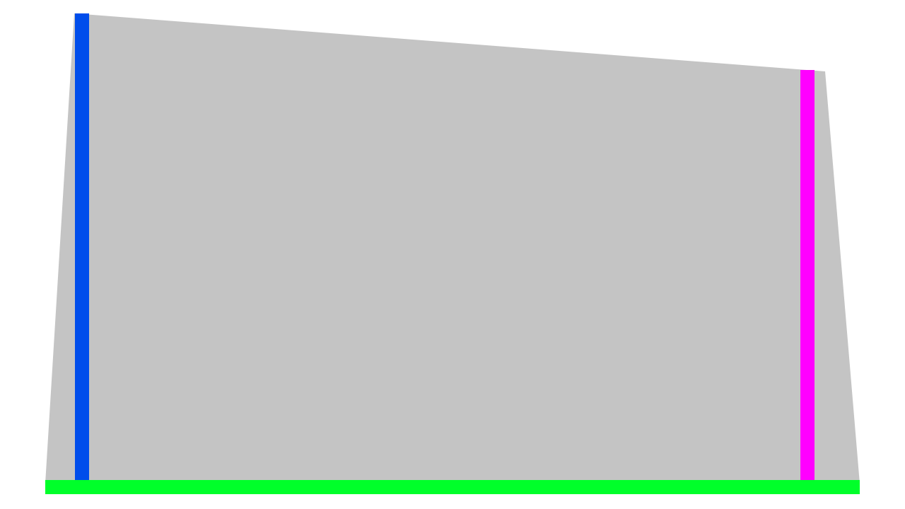
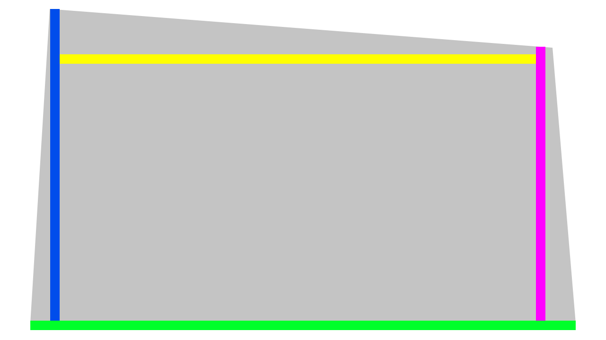

# Изготовление и сборка стола

## Изготовление теплораспределителя стола

Теплораспределитель стола в большинстве случаев приходится производить самостоятельно. Для этого используется алюминиевый лист толщиной 3мм при габарите наименьшей стороны до 300мм и 4мм при габарите более 300мм. Лист для производства стола лучше заказывать с небольшим припуском и отрезать точно в размер самостоятельно, т.к. рез листа на металлобазе может быть очень не точным или стороны стола могут быть не перпендикулярными.

Чтобы получить правильную геометрию стола, надо правильно разметить его перед резкой:

| Изображение | Описание |
|:-----------:|:-------- |
| { width=500} | Выберите базовую сторону (на рисунке выше отмечена зеленым). Обычно лучшим вариантом является длинная прямая сторона листа. В дальнейшем все размеры, включая угловые, будут откладываться только от этой стороны |
| { width=500 } | С помощью угольника и карандаша начертите линию, перпендикулярную базовой. Предпочтительно провести линию как можно ближе к одной из боковых сторон заготовки. Если одна из боковых сторон заготовки с достаточной точностью перпендикулярна базовой стороне, то можно использовать её |
| { width=500 } | Отмерьте габарит стола вдоль базовой линии (зеленой) и с помощью угольника проведите еще одну линию, перпендикулярную базовой |
| { width=500 } | Отмерьте второй габарит стола вдоль линий, перпендикулярных базовой (вдоль синей и розовой), после чего соедините две полученные точки |
| { width=500 } | Сравните длины противолежащих сторон полученного прямоугольника, они должны быть равны. Если это так, то сравните еще и длину диагоналей (красные стрелки). Если длина какой-то пары отрезков не равна, то в построение закралась ошибка. Придётся проверять все размеры и углы |
| { width=500 } | Отрежьте лишние участки заготовки по нанесенной разметке. Для резки алюминиевого листа можно использовать лобзик с полотном по металлу или ножовку. Чтобы рез был ровным, можно приклеить на заготовку направляющую из какого-нибудь бруска, в который будет упираться подошва лобзика или полотно ножовки. Далее края надо будет обработать от заусенцев, чтобы потом не порезать пальцы |

## Сверление отверстий в теплораспределителе

Количество отверстий в столе зависит от ваших предпочтений. Для небольших столов, например, 200х200мм, хватит 4 точек крепления, и, соответственно, 4 отверстий по углам. Если габарит какой-то стороны превышает 300мм, то рекомендуется добавить центральные точки вдоль этой стороны. Если обе стороны превышают 300мм, то рекомендуется использовать все 9 точек крепления, включая центральную, так как это позволит бороться с линзовидным изгибом стола от нагрева.

Все отверстия должны быть с зенкованием под винты М3 с потайной головкой. Головка винтов обязательно должна утапливаться ниже поверхности стола т.к. на стол будет помещаться какое-либо покрытие.

## Заказ грелки

В случае, если планируется использовать стол с 4 или 6 крепежными точками, то грелка заказывается по размеру области печати (на 50мм меньше плиты стола по оси Y). Вырезы под винты в таком случае не нужны т.к. винты будут располагаться вокруг грелки.

Если предполагается использование 8 или 9 точек крепления, то необходимо будет написать продавцу грелок, чтобы он сделал вырезы под винты. Термистор при этом стоит располагать как можно ближе к центру грелки.

## Cборка стола

Единственный не очевидный многим момент в наклейке грелки на теплораспределитель - то, что поверхность теплораспределителя надо предварительно обезжирить. Иначе велик шанс, что в каком-то месте грелка отойдёт и перегреется, что в лучшем случае приведет к необходимости переделывать стол, а в худшем - к пожару.

Установите винты М3х50 с потайной головкой в отверстия в теплораспределителе стола и зафиксируйте их резьбовыми втулками. Желательно посадить втулки на резьбовой герметик т.к. если они открутятся, то придётся пересобирать пол стола. При этом случаи, когда эти винты надо было бы снять для обслуживания принтера очень маловероятны.

!!! note "Втулки удобны тем, что одновременно с фиксацией винтов позволяют еще и центрировать пружины. Если втулок нет, то можно зафиксировать винты обычными гайками М3, а пружины центрировать любым другим способом."

---

<a property="dct:title" rel="cc:attributionURL" href="https://k3d.tech/vostok/">K3D VOSTOK</a> by Dmitry Sorkin is licensed under <a href="http://creativecommons.org/licenses/by/4.0/?ref=chooser-v1" target="_blank" rel="license noopener noreferrer" style="display:inline-block;">CC BY 4.0</a>
