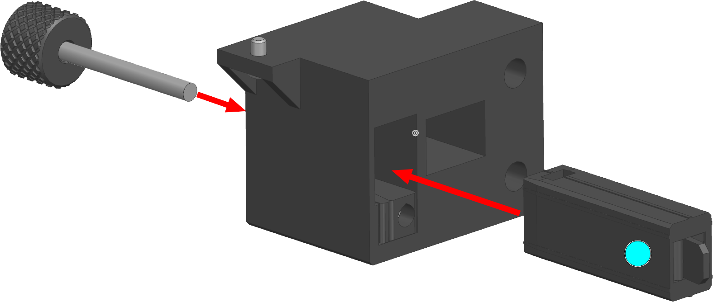
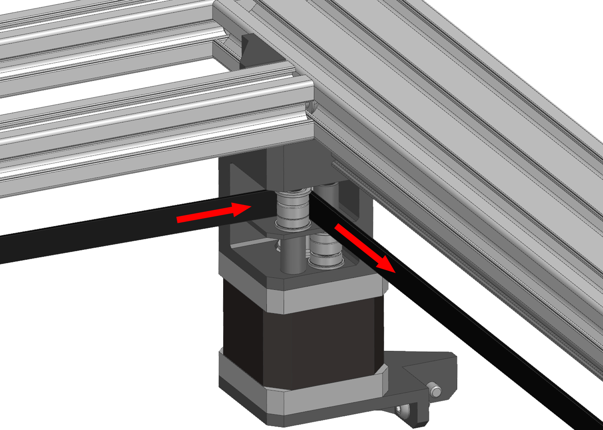
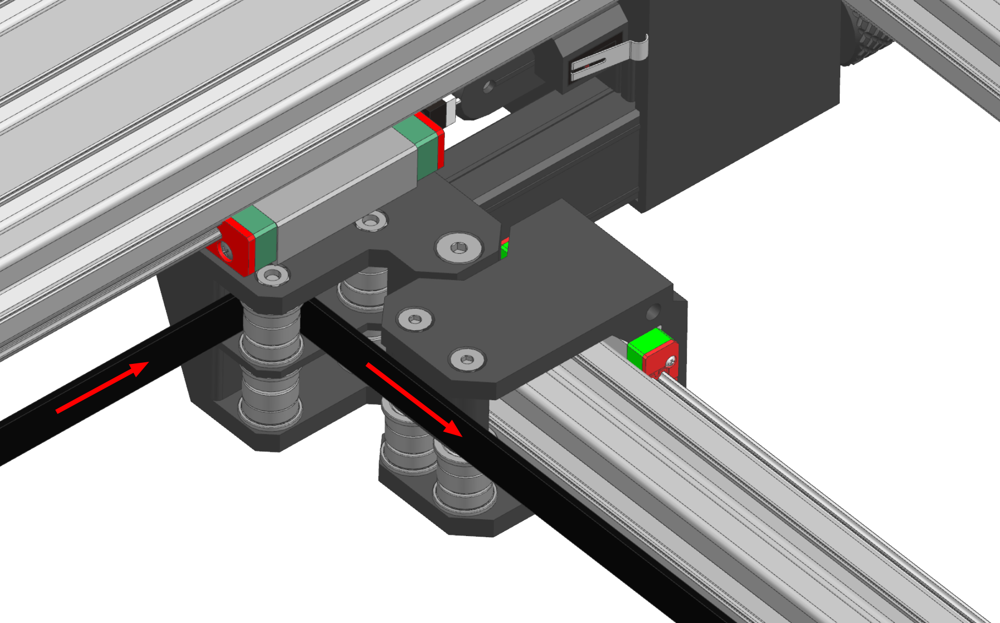
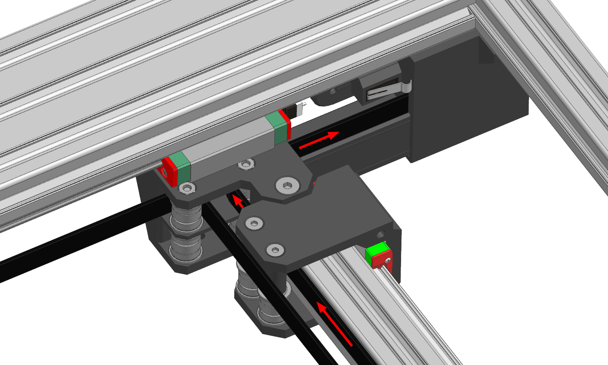
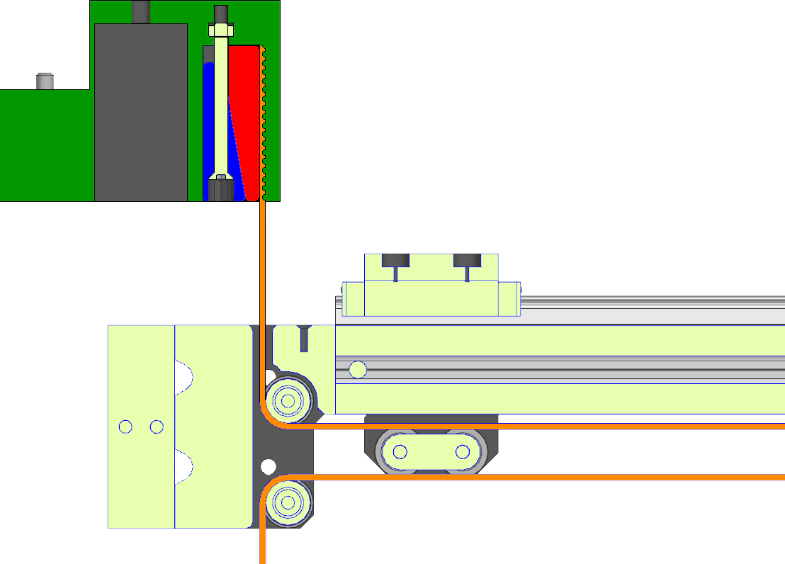
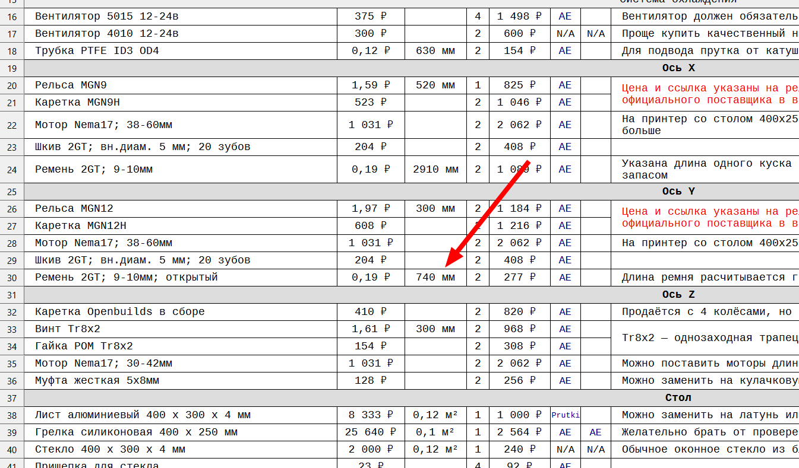
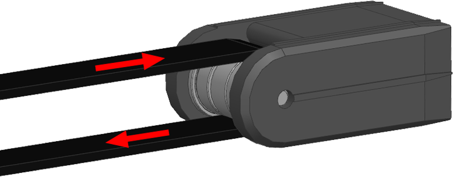
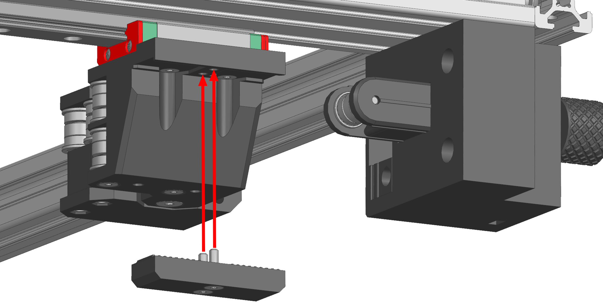

# Установка ремней

## Подготовка нервов

Перед тем, как приступать к прокладке ремней, рекомендуется запастись некоторыми расходниками, которые помогут успешно завершить этот этап сборки принтера:

- Пиво по вкусу сборщика. Количество бутылок - не менее 2шт.: 1 чтобы успокоиться после прокладки первого ремня и еще одна чтобы свыкнуться с мыслью, что это придётся пройти еще раз;
- Сушеная рыбка или чипсы. Помогут увеличить успокаивающие свойства пива без увеличения свойств одурманивающих;
- Как минимум 1 подушку, чтобы орать в неё матом при приступах гнева.

Главное, пробрасывая ремни, помните, что когда-то это закончится! Удачи и да хранит вас калибровочный куб.

## Подготовка деталей

<figure markdown>
  { width="400" }
</figure>

Для установки ремней нужно будет напечатать 2 детали `Vx-01-01-01-02 - Y belt clamp`. Деталь лучше печатать в ориентации как на изображении выше, с большим количеством периметров (5+) и 100% заполнением. При этом очень желательно использовать жесткие материалы, например, `ABS`, `SAN`, `PA6`, `PA6.6` и композиты на их основе. 

## Ремни осей X и U

Ремни осей X и U устанавливаются зеркально, так что имеет смысл описать установку только одного из них. Удобнее начинать с ремня оси U, так как он находится ниже. Но, так как установка второй печатающей головы и, соответственно, ремня оси U является опциональным, будет описана установка ремня оси X.

### Общая схема установки ремня оси Х - вид сверху

<figure markdown>
  { width="800" }
</figure>

На этой схеме:

- :red_square: - ремень
- :blue_square: - корпус натяжителя
- :green_square: - мотор оси X
- :orange_square: - ползун натяжителя
- :purple_square: - каретка оси X

### Общие рекомендации

1. Все крепления роликов сделаны таким образом, чтобы не допускать переворот ремня. Если при установке ремня вы сами допустите переворот ремня, то его нельзя будет устранить пост-фактум. Придётся доставать ремень до той секции, где он перекручен, исправлять всё и протягивать дальше заново;
2. Приблизительную длину ремня можно узнать в [спецификации](./releases.md) в разделе `покупные изделия`. Учтите, что эта цифра считается очень приблизительно и, если отрезать кусок ремня именно такой длины, то его может не хватить. Поэтому, если купленный кусок ремня это позволяет, то рекомендуется протягивать его целиком и резать по месту. Таким образом вы точно не промахнетесь с его длиной;
3. Для протяжки ремня удобно использовать изогнутый пинцет, хотя можно обойтись и без его помощи;
4. Протяжка ремня осей XU в VOSTOK'е достаточно сложное действие, которое очень не хочется переделывать. Поэтому рекомендуется на каждом этапе проверять вообще всё, что только можно проверить.

### Крепление свободного конца ремня в ползун натяжителя

<figure markdown>
  { width="600" }
</figure>

На этой схеме:

- :orange_square: - ремень
- :green_square: - корпус ползуна натяжителя
- :blue_square: :red_square: - механизм крепления ремня

Закрепите свободный конец ремня в ползун натяжителя как указано на схеме выше. Для этого придётся частично разобрать механизм ползуна. Сильно затягивать винт не имеет смысла так как ремень будет держаться и при слабой затяжке винта. При этом, если затянуть винт очень сильно, то детали могут заякориться друг за друга и будет проблематично разобрать механизм.

<figure markdown>
  { width="600" }
</figure>

Установите ползун в корпус натяжителя. Обратите внимание, что ремень должен быть ближе к внутренней стороне принтера (стенка отмечена голубым кружком). После этого зафиксируйте ползун винтом в начале хода, то есть буквально на несколько витков резьбы.

!!! note "Ползун должен входить в корпус натяжителя с усилием. Это сделано специально, чтобы в этом узле не было люфтов. Если идёт слишком тяжело, то можно попробовать спилить направляющие на ползуне и\или смазать его"

### Каретка оси X и левая каретка оси Y

<figure markdown>
  { width="600" }
</figure>

В проведении ремня через левую каретку оси Y и каретку оси X нет ничего сложного так как всё находится в доступе. Самое главное - следить, чтобы ремень не перекрутился нигде. В остальное всё делается так, как показано на изображении выше.

### Кронштейн мотора оси X

<figure markdown>
  { width="500" }
  Вид в разрезе
</figure>

Для того, чтобы провести ремень через кронштейн мотора оси X потребуется дополнительно какой-то плоский и тонкий предмет, например, обратная сторона пинцета или надфиль.

Вставьте ремень между роликом и проставкой (1), после чего направьте конец ремня за шкив мотора (2). Далее можно будет протолкнуть ремень, схватиться за его кончик и протащить его через привод (3).

### Кронштейн мотора оси U

<figure markdown>
  { width="500" }
</figure>

Проведите ремень через ролик как это показано на изображении выше. Не забудьте проверить, что нигде до этого ремень не перекрутился.

### Правая каретка оси Y

<figure markdown>
  { width="500" }
</figure>

Проведите ремень через задний ролик правой каретки оси Y как показано на изображении выше. Обратите внимание, что ремень проходит за проставкой каретки оси U.

### Каретка оси X

<figure markdown>
  { width="500" }
</figure>

Проведите ремень через второй ролик каретки оси X как показано на изображении выше. Проверьте, что нигде до этого ремень не перекрутился.

### Правая каретка оси Y

<figure markdown>
  { width="500" }
</figure>

Проведите ремень через передний ролик правой каретки оси Y как показано на изображении выше. Обратите внимание, что ремень проходит перед проставкой каретки оси U.

### Крепление в корпус правого натяжителя

<figure markdown>
  { width="800" }
</figure>

- :orange_square: - ремень
- :green_square: - корпус натяжителя
- :blue_square: :red_square: - механизм крепления ремня

Проверьте, что ремень нигде до этого не перекручен, что везде встал на ролики и шкивы правильно (не заходит на фланцы), отмерьте его по корпусу натяжителей и отрежьте в размер. После этого закрепите в корпус натяжителя по тому же принципу, как крепили в ползун натяжителя.

### Установка ремня оси U

Ремень оси U устанавливается зеркально ремню оси X.

## Ремни оси Y

### Общий вид установленного ремня оси Y - вид сбоку

<figure markdown>
  
</figure>

- :orange_square: - ремень
- :green_square: - шкив мотора оси Y
- :blue_square: - ползун натяжителя с роликом
- :red_square: - крепежная пластина ремня

### Подготовка

<figure markdown>
  { width="600" }
</figure>

Приблизительная длина ремня оси Y указана в [спецификации](./releases.md) на странице `покупные изделия`. Учтите, что эта цифра считается очень приблизительно и, если отрезать кусок ремня именно такой длины, то его может не хватить. Поэтому, если купленный кусок ремня это позволяет, то рекомендуется протягивать его целиком и резать по месту. Таким образом вы точно не промахнетесь с его длиной.

### Крепление ремня к крепежной пластине

<figure markdown>
  { width="500" }
</figure>

Для удобства сборки рекомендуется приклеить свободный конец ремня к крепежной пластине на каплю цианакрилатного клея. Если крепежная пластина распечатана из материалов на основе ПА или ПП, то потом можно будет достаточно легко снять ремень, если захочется его заменить.

### Ползун натяжителя с роликом

<figure markdown>
  { width="500" }
</figure>

Ремень продевается через ползун натяжителя с роликом как показано на изображении выше. Так как корпус ползуна симметричный, то продеть не той стороной невозможно.

<figure markdown>
  { width="700" }
</figure>

Установите ползун с роликом в корпус натяжителя и закрепите винтом в начале хода регулировки.

!!! note "Ползун должен входить в корпус натяжителя с усилием. Это сделано специально, чтобы в этом узле не было люфтов. Если идёт слишком тяжело, то можно попробовать спилить направляющие на ползуне и\или смазать его"

### Установка крепежной пластины ремня

<figure markdown>
  { width="700" }
</figure>

Установите крепежную пластину ремня на каретку оси Y и закрепите с помощью 2 винтов М3х12 с потайной головкой. Затягивать крепление на данном этапе не нужно, необходимо чтобы крепежная пластина просто встала на своё место.

### Окончательная установка ремня оси Y

<figure markdown>
  
</figure>

Теперь можно провести ремень через шкив мотора и вернуть его к крепежной пластине. Так как всё закреплено в рабочей позиции, то можно отмерить ремень и отрезать его. 

После этого крепежная пластина снимается, свободный конец клеится на неё так же, как в прошлый раз, и крепится обратно уже с полноценным затягиванием винтов. 

## Проверки

### Проверка ремня оси X

Попробуйте натянуть установленный ремень. Если всё собрано правильно, то он должен натягиваться не доходя до середины хода ползуна. Если это не так, то можно снять любой из свободных концов ремня, укоротить его на необходимую длину и установить обратно.

При натянутом ремне попробуйте подвигать каретку печатающей головы. Она будет двигаться с большим усилием ввиду редукции в кинематике, но при этом не должно быть каких-то серьезных заеданий или прочих дефектов движения. Если они есть, то надо внимательно осмотреть привод.

### Проверка ремня оси U

Ремень оси U проверяется аналогично ремню оси X, за исключением того, что нужно двигать правую печатающую голову.

### Проверка ремня оси Y

Попробуйте натянуть оба установленных ремня оси Y. Если всё собрано правильно, то они должны натягиваться не доходя до середины хода ползуна. Если это не так, то можно снять любой из свободных концов ремня, укоротить его на необходимую длину и установить обратно.

При натянутых ремнях попробуйте подвигать балку оси X, желательно за середину и не допуская сильных перекосов. Не должно ощущаться никаких заеданий, люфтов и так далее. Если они есть, то необходимо осмотреть приводы.

!!! note "Так как для некоторых дальнейшних действий по сборке принтера потребуется ослаблять ремни, рекомендуется не тратить время на какую-то особенно правильную натяжку ремней на этом этапе"
