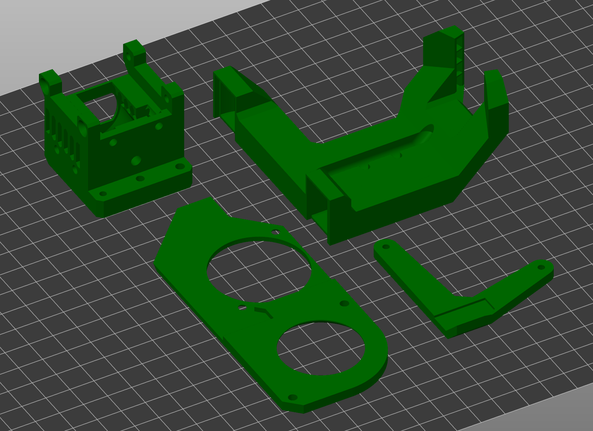
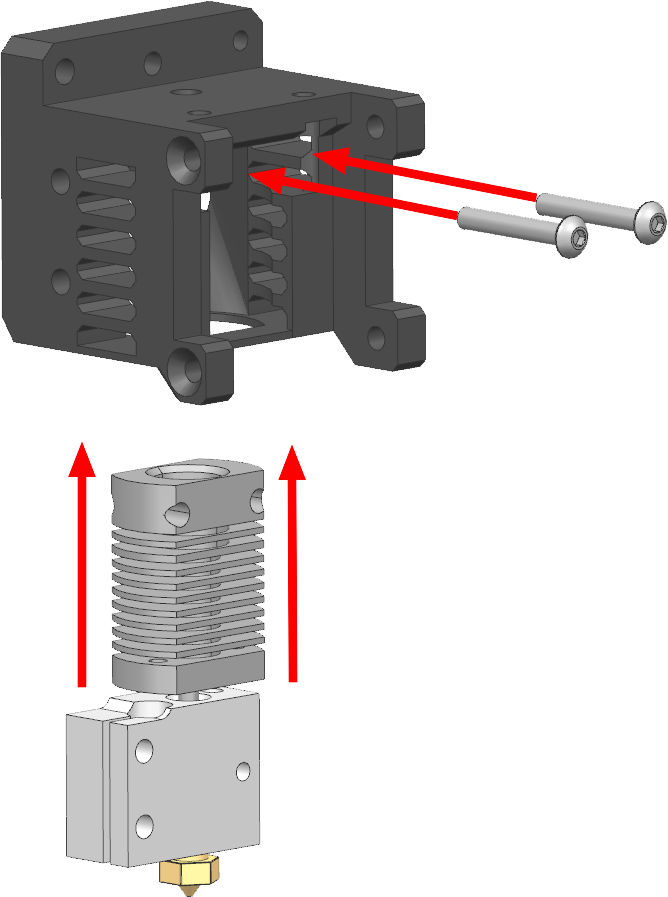
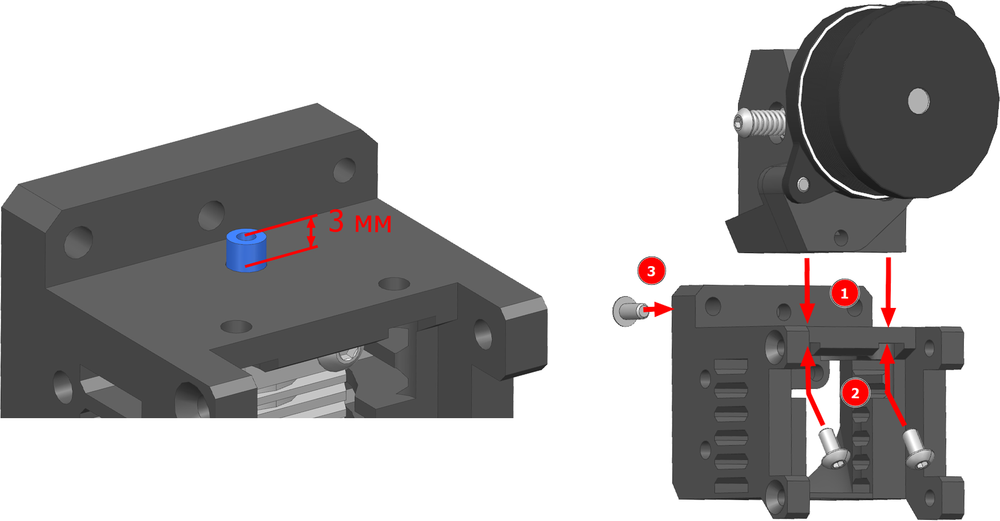
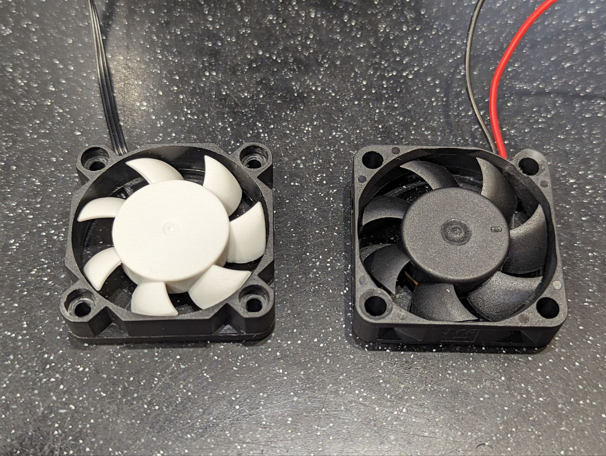
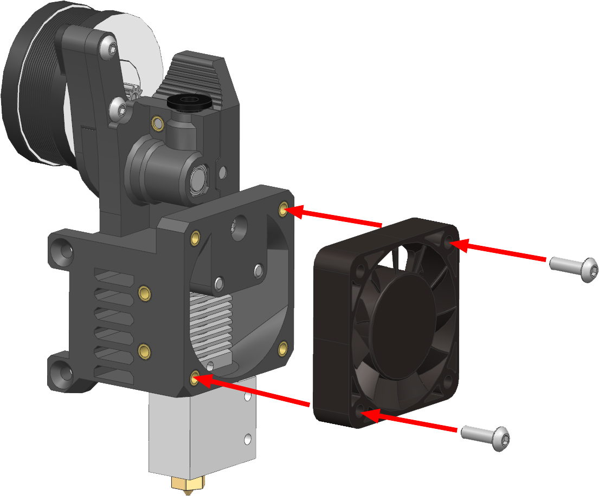

# Сборка печатающей головы LPH

Будет описан процесс сборки основной печатающей головы. Вторая голова собирается зеркально. Эту печатающую голову можно собрать в двух вариантах: с креплением вентиляторов 5015 на винты и на клей. В инструкции будет описан вариант крепления на винты. Если вы собираетесь крепить на клей, то вам не нужно печатать и делать любые операции с передней панелью системы охлаждения и с кронштейном заднего вентилятора.

## Подготовка печатных деталей

### Необходимые детали и материалы для них

| Наименование | Кол-во | Предпочтительный материал | Возможный материал | Примечание |
|:------------ |:------:|:-------------------------:|:------------------:|:---------- |
| LPH case (CR-10) | 1 | `PA6 GF30`, `PP GF30` | `PA12 GF30`, `ABS GF/CF`, `ABS`, `PC`, `ASA` | Не зеркалится |
| LPH volcano dual 5015 fan duct | 1 | `ABS GF/CF`, `ABS`, `ASA`, `PA6 GF30` | `PP GF30`, `PA12 GF30` | Для правой головы отзеркалить |
| LPH volcano front panel | 1 | Любой с термостойкостью >80°C |  | Для правой головы отзеркалить |
| LPH back fan mount | 1 | Любой с термостойкостью >80°C |  | Для правой головы отзеркалить |

### Ориентация деталей и особенности печати

<figure markdown>
  { width="400" }
</figure>

В указанной ориентации детали печатаются без поддержек.

Для детали `LPH case` настройки стоит подобрать так, чтобы обеспечивалась максимальная жесткость и прочность. Критически важное место - ушки. Очень важно, чтобы пластик в них хорошо спекся, так что их лучше печатать медленно и с перегревом.

Для детали `LPH volcano dual 5015 fan duct` важно, чтобы не провисли мостики при печати. Поэтому рекомендуется сначала потренироваться печатать детали с мостами из того филамента, который вы выберете, и только потом приступать к печати этой детали. Также особенностью является то, что когда будут печататься мостики, они будут стягивать тонкие боковые стенки друг к другу, что вызовет небольшую ступеньку на стенке. Это не критично и закроется приклеиванием передней панели. 

Остальные детали стоит печатать так, чтобы они весили как можно меньше, но при этом не теряли жесткость.

## Сборка печатающей головы LPH

### Вплавление резьбовых втулок

<figure markdown>
  { width="400" }
</figure>

На изображении выше указаны отверстия, в которые обязательно надо вплавить втулки для использования этой печатающей головы в качестве левой. Красным обозначены отверстия для втулок М3х3, фиолетовым М3х5. Для правой головы зеркально. В другие аналогичные отверстия тоже можно вплавить втулки, но это не обязательно для сборки.

Перед вплавлением втулки пройдите отверстие сверлом. Диаметр сверла под втулку обычно указывается продавцом втулок. Если не указан, то берите сверло диаметром, равным диаметру самой узкой части втулки или чуть меньше.

Втулки вплавляются обычным паяльником. Если боитесь, что внутрь резьбы попадёт расплавленный пластик, то можно вкрутить во втулку небольшой винтик и греть через него.

После вплавления втулки следует срезать образовывашийся натёк ножом. Если отверстие сквозное, то, скорее всего, образуется комок пластика за втулкой. В таком случае его надо убрать. Можно сделать это закручиванием длинного винтика во втулку, он просто вытолкнет комок дальше.

<figure markdown>
  { width="900" }
</figure>

В переднее и заднее крепления вентиляторов 5015 вплавляются втулки М3х3. С передней панелью действовать надо аккуратно так как если пройти сверлом слишком глубоко, или вплавить втулку глубоко, то повредится лицевая сторона панели.

### Склейка сопла системы охлаждения модели

<figure markdown>
  { width="400" }
</figure>

Передняя панель и кронштейн заднего вентилятора приклеиваются на сопло системы охлаждения как показано на картинке сверху. Клей можно использовать практически любой так как эти соединения не особо нагружены.

### Сборка системы охлаждения модели

<figure markdown>
  { width="400" }
</figure>

Вентиляторы 5015 прикручиваются к системе охлаждения на винты М3х18 с потайной головкой. Для того, чтобы головки винтов не мешали установке системы охлаждения на голову, надо будет зенковать отверстия у вентиляторов, чтобы головки винтов вставали вровень с поверхностью вентиляторов. Обратите внимание, что у 1 вентилятора отверстия зенкуются с передней стороны, а у другого с задней.

### Сборка экструдера

<figure markdown>
 { width="400" }
</figure>

Хотэнд в сборе устанавливается снизу и крепится двумя винтами М3х20.

Если вы используете хитблок Volcano, то обратите внимание на ориентацию хотэнда. Он должен быть повёрнут нагревателем от предполагаемого расположения системы охлаждения. При этом нагреватель и термистор уже должны быть установлены в хитблок.

Если вы используете хитблок CHC Pro, то придётся снять небольшую пластинку, которая предотвращает перегибание проводов. После установки системы охлаждения, её корпус будет держать провода недвижимо, так что шанс сломать провода в процессе эксплуатации не велик. Выход проводов лучше ориентировать в сторону углубления в системе охлаждения.

<figure markdown>
  { width="900" }
</figure>

1. Вставьте PTFE трубку ID2 OD4 в отверстие и обрежьте так, чтобы кончик выступал на ~ 3 мм;
2. Установите подающий механизм на корпус печатающей головы и прикрутите винтами М3х6 с полукруглой головкой. В случае использования LGX Lite используются два винта (2), в случае Minifeeder еще и дополнительный третий винт спереди (3).

### Установка вентилятора охлаждения хотэнда

<figure markdown>
  { width="400" }
</figure>

Вентиляторы 4010 бывают с углублениями под головки винтов (как слева) и без них (справа).

- Если углубления есть, то используются винты М3х10 с полукруглой или цилиндрической головкой;
- Если углублений нет, то можно:
    - Создать их с помощью цековки или даже сверла с достаточно большим углом при вершине (для наших целей сойдёт). В таком случае будут использоваться такие же винты, как если углубления были;
    - Зенковать отверстие под винт М3х12 с потайной головкой (показано справа).

<figure markdown>
  { width="500" }
</figure>

Установите вентилятор на место в таком положении, чтобы провод выходил наверх. Зафиксируйте двумя винтами, выбранными ранее. Обратите внимание на то, на какие именно отверстия крепится вентилятор. Для правой головы отверстия следует выбирать зеркально.

### Установка системы охлаждения

<figure markdown>
  { width="900" }
</figure>

1. Установите систему охлаждения сбоку так, чтобы провода от хотэнда попали в углубление и наживите два винта М3х16 с потайной головкой сбоку;
2. Вставьте два оставшихся винта М3х16 в отверстия спереди. После этого можно затянуть все винты крепления системы охлаждения к корпусу печатающей головы.

### Сборка жгута от печатающей головы

Все провода от всех потребителей собираются в жгут и подключаются к вилке разъёма GX20 15pin. Разъём служит для того, чтобы голову можно было легко снять на ремонт или обслуживание. Если вы не хотите пользоваться этим разъёмом, то просто подключите всех потребителей напрямую к плате или используйте разъёмы на своё усмотрение.

Контакты в разъёме пронумерованы, номера нанесены прямо на пластиковый изолятор. Поэтому схема подключения представлена в виде таблицы:

| № пина | Потребитель |
|:------:|:----------- |
| 1 | Мотор экструдера |
| 2 | Мотор экструдера |
| 3 | Мотор экструдера |
| 4 | Мотор экструдера |
| 5 | Термистор |
| 6 | Термистор |
| 7 | + 12V |
| 8 | + 24V |
| 9 | Вентилятор обдува хотэнда GND |
| 10 | Вентиляторы обдува модели GND |
| 11 | Нагреватель хотэнда |
| 12 | Резерв |
| 13 | Резерв |
| 14 | Резерв |
| 15 | Резерв |

Вентиляторы обдува модели подключаются параллельно. Плюс подключается к тому напряжению, которое потребно для вентиляторов. Аналогично с вентилятором обдува хотэнда и нагревателем. Четыре свободных пина можно использовать под любые нужды: для датчиков автоуровня, подсветки на голове и т.д.

[^1]: зенковка - инструмент для создания конического углубления вокруг отверстия.
