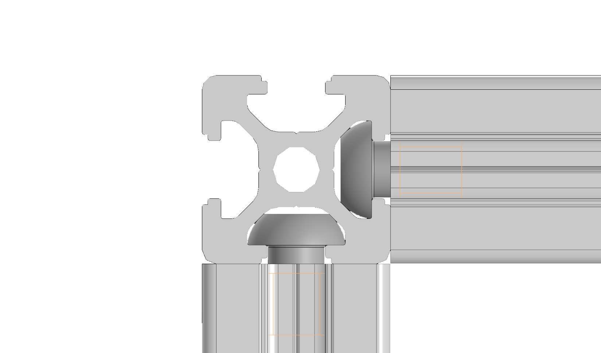
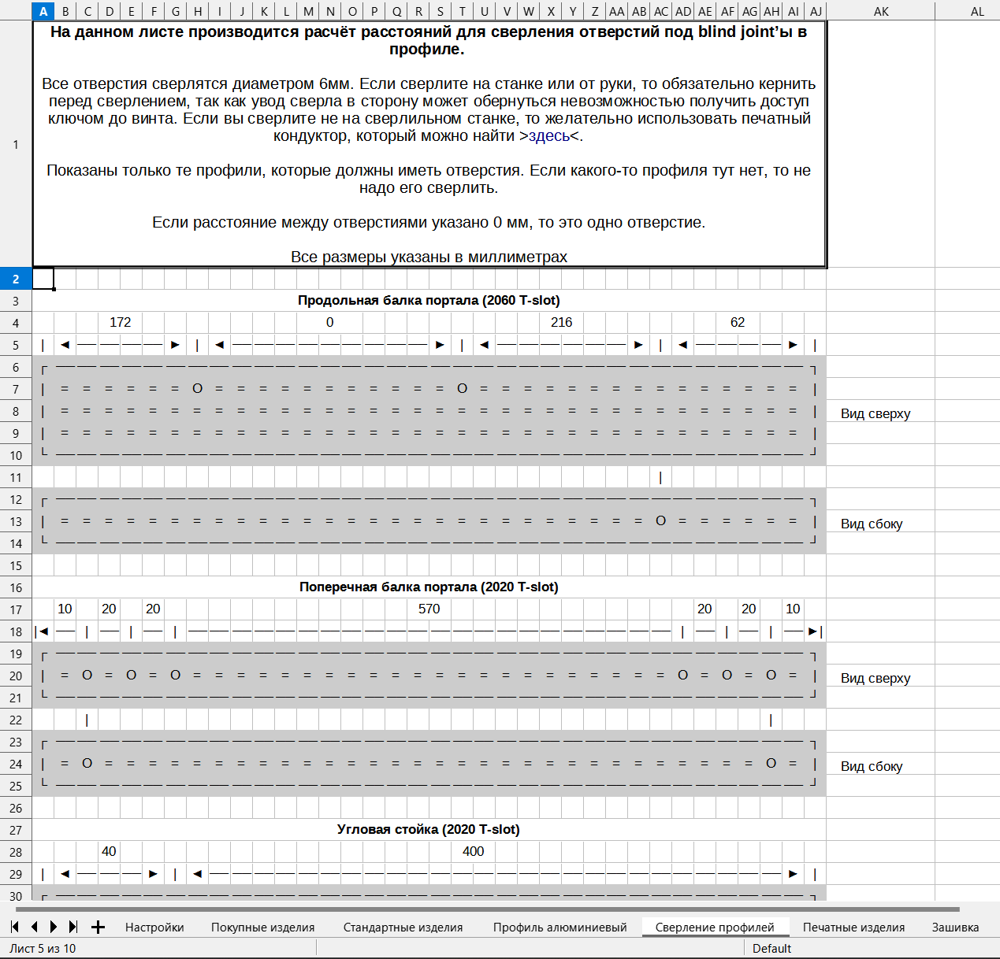

# Шаг 1. Подготовка профилей

## Необходимые инструменты

Так как основную жесткость раме придают панели зашивки, профили в раме VOSTOK'а могут соединяться несколькоими способами, но основным является blind joint. Это соединение предполагает, что винт М6 будет вкручен в торец профиля, а головка винта будет заведена в паз другого профиля, пристыкованного перпендикулярно. Такое соединение требует нарезки резьбы в торцах профилей, а также сверления профилей для доступа ключом к шлицу винта.

Для выполнения этих работ потребуется:

| Наименование | Примечание |
|:------------ |:---------- |
| Набор метчиков М6 | Для нарезки резьбы в торцах профилей |
| Зенковка | Чтобы делать фаски на резьбовых отверстиях. Не обязательно |
| Сверлильный станок | Вместо станка можно использовать дрель/шуруповёрт + [кондукторы](./tools.md) |
| Сверло :material-diameter-variant:6мм | |
| Кернер | Чтобы сверло не уводило в сторону |
| Тиски или струбцина | Чтобы держать профиль во время работы с ним |

## Нарезка резьбы в торцах профилей

Резьбу М6 надо нарезать во всех торцевых отверстиях всех профилей, кроме:

- Балки оси Х;
- Балок рамы стола.

В целом, процесс нарезания резьбы не имеет каких-то подводных камней, так что описывать как это правильно делать не имеет большого смысла. Дам только пару рекомендаций:

1. Лучше использовать наборы из 2-3 метчиков, где каждый нарезает резьбу глубже предыдущего;
2. Ломайте стружку при нарезке резьбы. Один оборот вперед - половина назад, еще один вперед, еще половина назад. Иначе налипшая на метчик стружка помнёт профиль;
3. Не забудьте высыпать стружку из профилей после нарезки.

Процесс нарезки резьбы показан [в этом видео](https://youtu.be/7GxtSSZW7pc?t=55).

## Сверление отверcтий 

Для доступа ключом к шлицам винтов в соединениях, некоторые профили надо будет просверлить. Состав этих профилей, а также все необходимые координаты для этого процесса рассчитываются автоматически на листе `Сверление профилей` в спецификации (BOM). 

- Отверстия схематично изображены окружностями;
- Диаметр всех отверстий 6мм;
- Выше схемы профиля находится размерная цепь, начинающаяся от торца профиля;
- Все размеры указаны в миллиметрах (в сантиметре 10мм, в метре 1000мм);
- Если между двумя отверстиями указано расстояние 0 мм, то это одно отверстие;
- Профили, которые не должны быть просверлены, не упоминаются на этом листе;
- Все профили одного типа сверлятся по одинаковой схеме.

Сверление лучше всего производить на сверлильном станке с предварительным кернением. Если такого оборудования нет, то можно обойтись шуруповертом и печатными кондукторами, которые можно найти [на странице с инструментами](./tools.md).

!!! warning ""
    Отклонение по положение или углу отверстий может привести к невозможности подлезть ключом к шлицу винта. В таком случае отверстие придётся расширять напильником или шарошкой.
