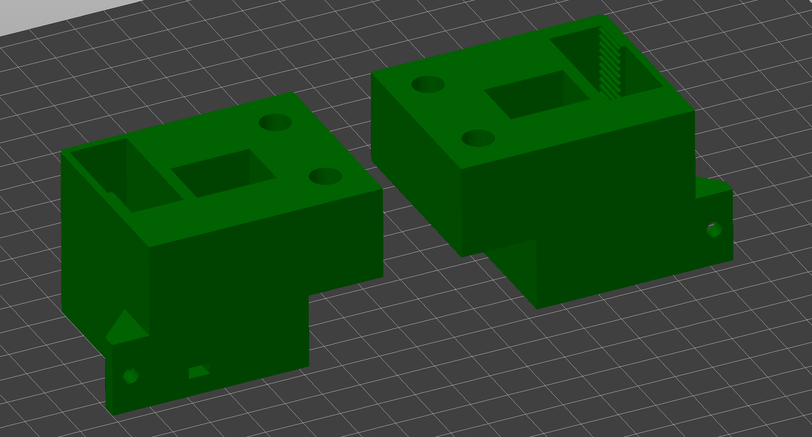
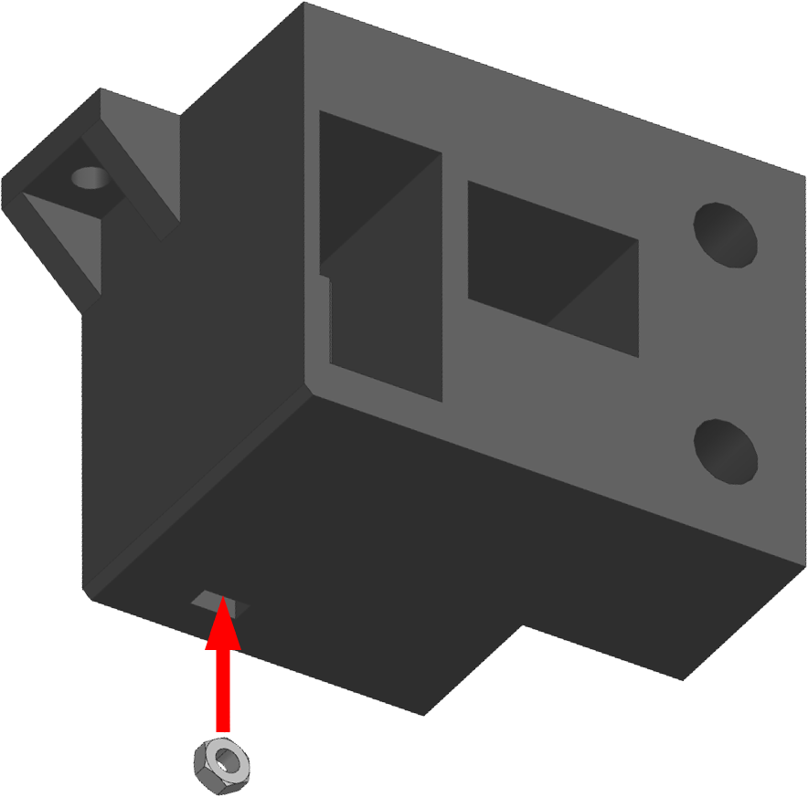
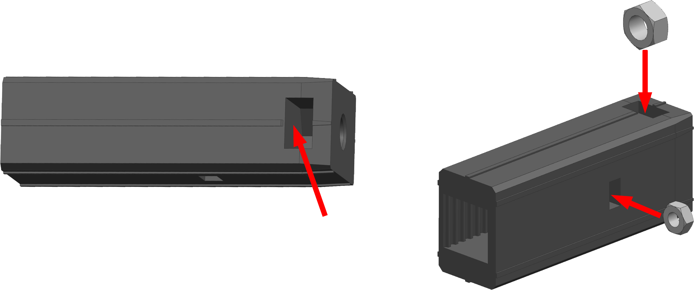
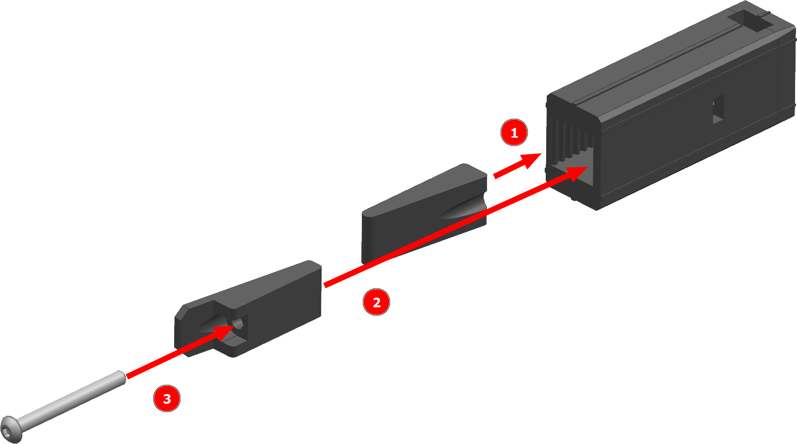

# Шаг 7 - Сборка и установка натяжителей ремней

## Подготовка печатных деталей

### Необходимые детали и материалы для них

| Наименование                   | Кол-во |        Предпочтительный материал         |
| :----------------------------- | :----: | :--------------------------------------: |
| Left belt tensioner base       |   1    |  Любой жесткий с термостойкостью >70°C   |
| Right belt tensioner base      |   1    |  Любой жесткий с термостойкостью >70°C   |
| Belt tensioner belt clamp      |   2    |  Любой жесткий с термостойкостью >70°C   |
| Belt tensioner plunger         |   2    |  Любой жесткий с термостойкостью >70°C   |
| Belt tensioner (roller) body   |   2    | `PETG`, `PA12`, `PA6`, `PA6 GF`, `PP GF` |
| Belt tensioner (0.5XY) body    |   2    | `PETG`, `PA12`, `PA6`, `PA6 GF`, `PP GF` |
| Belt tensioner (0.5XY) clamp   |   2    |  Любой жесткий с термостойкостью >70°C   |
| Belt tensioner (0.5XY) plunger |   2    |  Любой жесткий с термостойкостью >70°C   |
| Belt tensioner knob            |   4    |              Любой жесткий               |
| Belt tensioner knob cap        |   4    |              Любой жесткий               |

### Ориентация деталей и особенности печати

Детали `* belt tensioner base` печатаются в ориентации, указанной на изображении выше. При этом требуется использовать поддержки "от стола".

Эти две детали являются очень крупными, но при этом от них требуется высокая прочность и жесткость. Так что рекомендуется использовать более дешевые материалы для печати, например, `PETG`. При этом лучше поставить толщину периметров, дна и крышки >2мм и 100% заполнения.

Остальные детали печатаются без поддержек в указанной ориентации. Требуется любой жесткий и хорошо спекающийся материал. Периметры 2-3мм, 100% заполнения.

## Установка корпусов натяжителей

Для облегчения установки рекомендуется положить принтер на переднюю панель. Не забудьте поставить временные упоры для рельс, чтобы каретки не соскочили.

### Установка левого корпуса натяжителей

Установите гайку М3 в углубление в нижней части `Left belt tensioner base` и продвиньте её до конца. Если она плохо держится, то лучше будет закрепить её каплей клея или чем-нибудь подобным.

Заложите в указанные пазы пазовые гайки М4. В нижний паз поперечной балки закладывается 1 гайка, в вертикальную стойку 2 гайки

Установите корпус натяжителей на место и зафиксируйте винтами М4х8. 

### Установка правого корпуса натяжителей

Установка правого корпуса натяжителей происходит аналогично установке левого, но зеркально. Главное - не забыть заложить гайку М3 заранее, так как доступ к ней потеряется.

## Подготовка ползунов натяжителя

На этом этапе натяжители еще рано устанавливать, так как это будет сделано позже, на этапе установки ремня. Но натяжители следует собрать.

### Сборка ползуна с роликом

Заложите гайку М5 в корпус натяжителя под ролик. Если гайка плохо держится в углублении, то стоит зафиксировать её каплей клея.

Соберите ролик из двух подшипников f623, одного подшипника 623 и шайбы М3, соединенных таким образом, как показано на изображении выше. При этом не важно между какой парой подшипников располагается шайба. 

Для удобства сборки рекомендуется все ролики предварительно собрать и обклеить полоской скотча, чтобы те не рассыпались, и их можно было бы устанавливать как единую деталь. После сборки скотч с роликов необходимо будет снять.

Установите ролик, как показано на изображении выше, и закрепите винтом М3х20 с потайной головкой. Винт вкручивается прямо в пластик детали. Если конец винта будет торчать за пределы детали, то рекомендуется его зашлифовать, чтобы не мешал установке ползуна в корпус.

### Сборка ползуна с фиксированным креплением ремня

В детали Belt tensioner (0.5XY) body необходимо будет удалить мембраны в отверстиях под гайки. Проще всего удалить их сверлами D3 и D5 соответственно.

Установите гайки М3 и М5 в соответствующие углубления и, если они там плохо держатся, закрепите каплями клея.

В углубление сначала закладывается деталь `clamp` вырезом от зубчатой части. Потом деталь `plunger` язычком к зубчатой части. Потом это крепится винтом М3х30 с полукруглой или цилиндрической головкой. Как-то затягивать без ремня не имеет смысла.

### Сборка винтов натяжителей

Болт М5х50 вставляется в деталь `Belt tensioner knob` как показано на изображении выше, и закрывается колпачком. Колпачок крепится на клей.

## Окончательная сборка

Окончательная сборка натяжителей осуществляется одновременно с установкой ремня.

