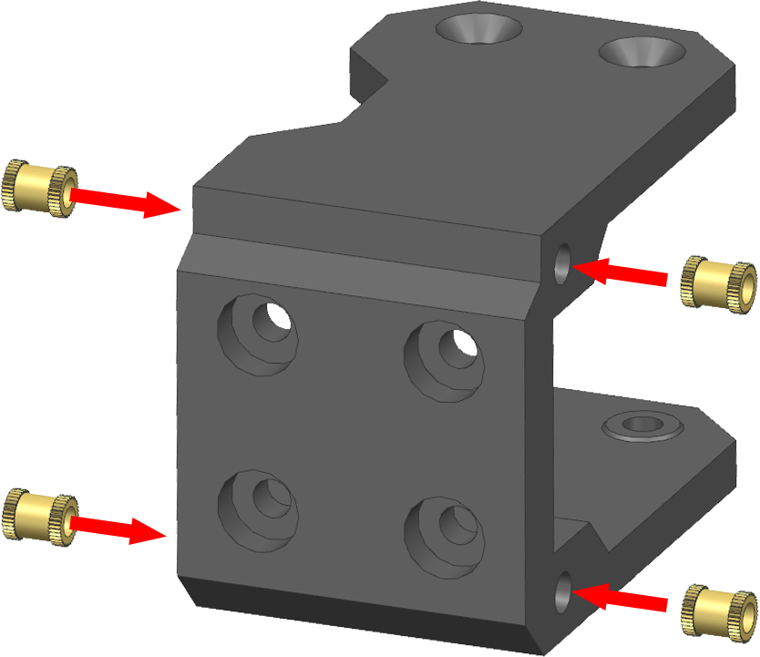
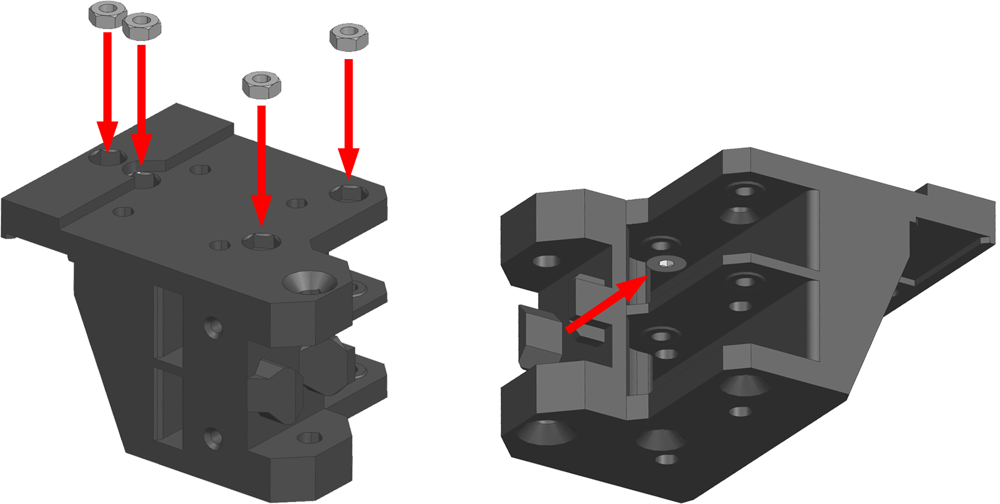
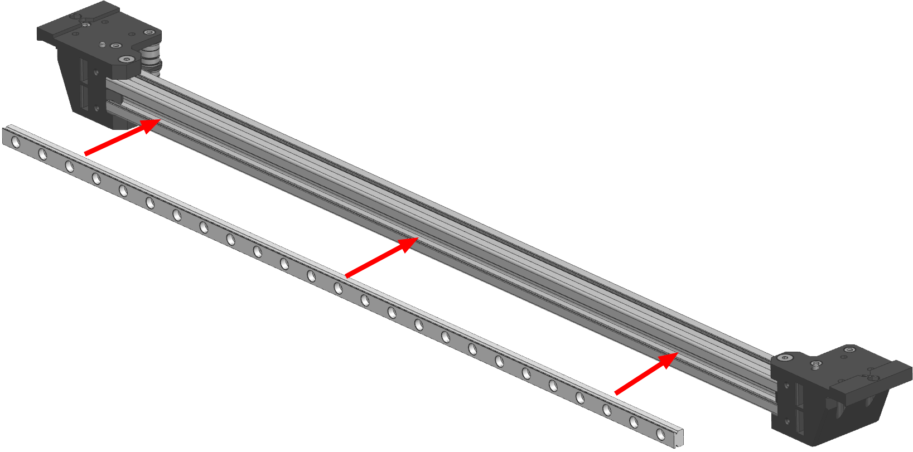
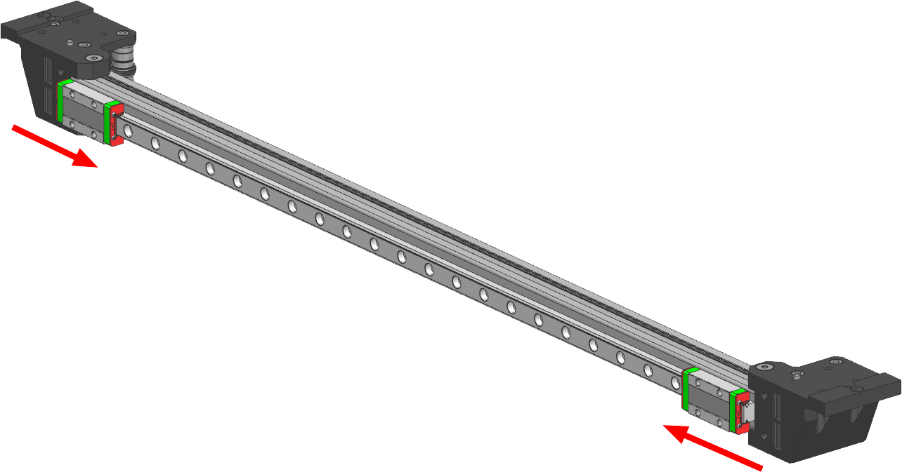
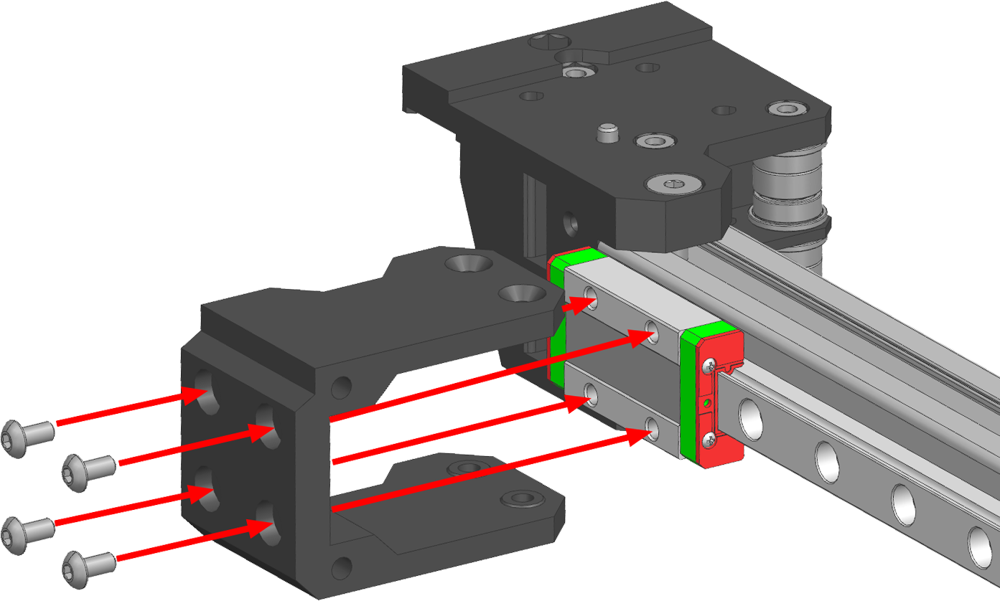
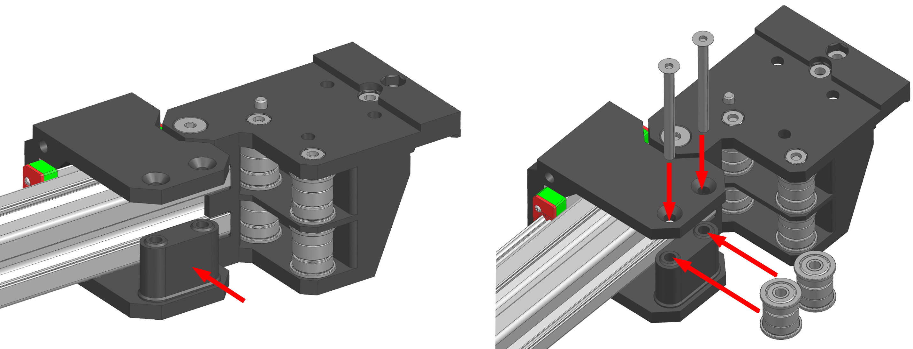
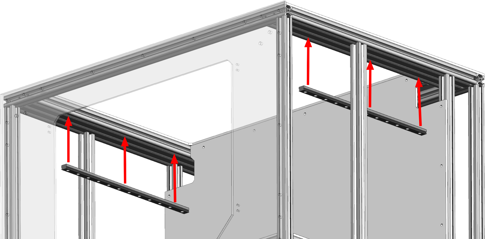
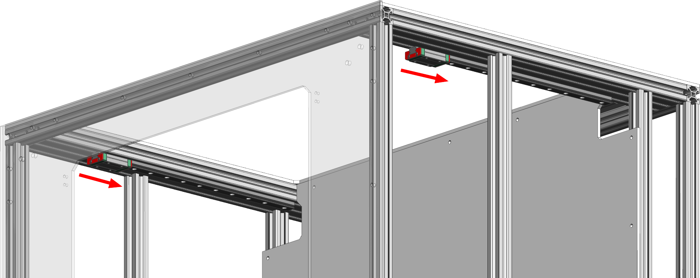
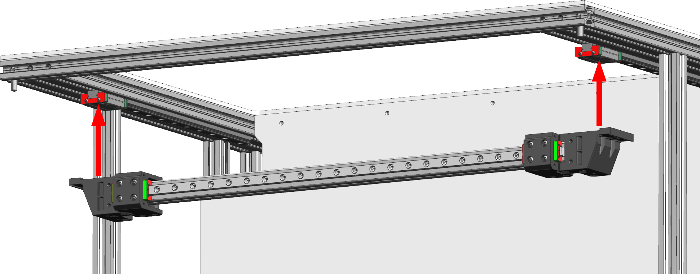
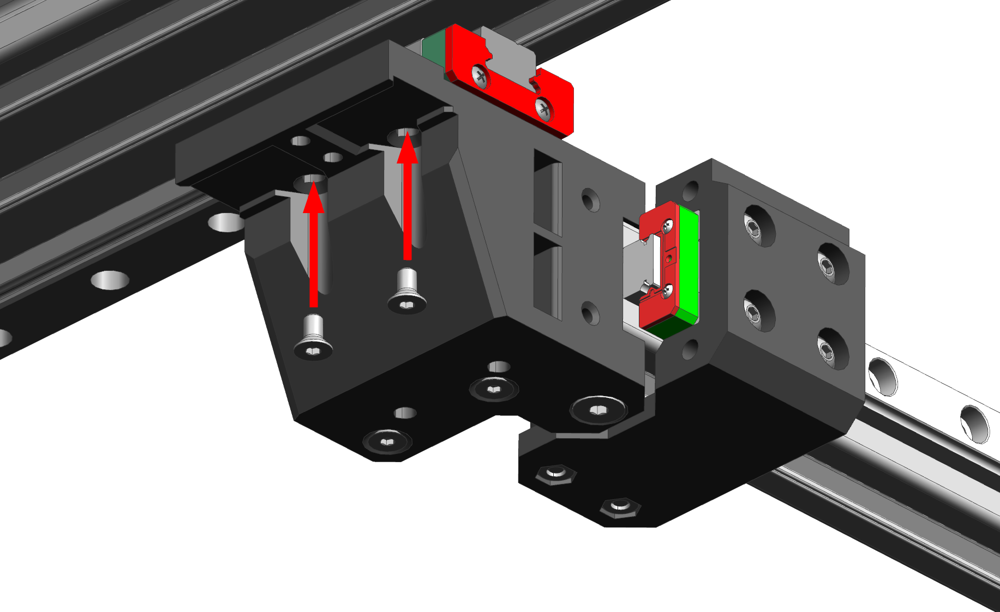

# Сборка балки оси X

## Подготовка печатных деталей

### Необходимые детали и материалы для них

| Наименование | Кол-во | Предпочтительный материал | Возможный материал | Примечание |
|:------------ |:------:|:-------------------------:|:------------------:|:---------- |
| Y carriage base | 2 | `PA6 GF30`, `PP GF30` | `PA12 GF30`, `ABS GF/CF`, `ABS`, `PC`, `ASA` | Одна зеркально |
| Lite print head mount | 1-2 | `PA6 GF30`, `PP GF30` | `PA12`, `PA6`, `PETG` | Количество равно количеству печатающих голов. Если 2, то одна из них печатается зеркально |
| 0.5XY print head roller spacer | 1-2 | Любой | - | Количество равно количеству печатающих голов. Не зеркалится |

### Ориентация деталей и особенности печати

<figure markdown>
  { width="500" }
</figure>

В указанной ориентации детали печатаются без поддержек.

Для всех деталей, кроме `0.5XY print head roller spacer`, стоит подбираться параметры печати таким образом, чтобы прочность и жесткость были как можно выше. То есть:

- периметры 2-3 мм;
- 100% заполнение;
- ширина линий >120% от диаметра сопла;
- толщина слоя 0.1-0.15, скорость пониже.

### Вплавление резьбовых втулок

<figure markdown>
  { width="400" }
</figure>

В деталь `Lite print head mount` необходимо вплавить 4 резьбовые втулки М3х5. Если диаметр внешней части резьбовой втулки отличается от диаметра отверстия (~3.5мм), то отверстия необходимо будет предварительно рассверлить.

## Сборка балки оси X

### Подготовка роликов

<figure markdown>
  { width="500" }
</figure>

Все ролики в принтере состоят из двух подшипников f623, одного подшипника 623 и шайбы М3, соединенных таким образом, как показано на изображении выше. При этом не важно между какой парой подшипников располагается шайба.

Для удобства сборки рекомендуется все ролики предварительно собрать и обклеить полоской скотча, чтобы те не рассыпались, и их можно было бы устанавливать как единую деталь. После сборки скотч с роликов необходимо будет снять.

### Сборка каретки оси Y

<figure markdown>
  { width="500" }
</figure>

1. Вставьте гайки м3 в углубления в `Y carriage base`;
2. Вставьте винт М3х6 с потайной головкой в указанное отверстие и зафиксируйте его так, чтобы он не выпадал, например, гайкой М3 или кусочком скотча с наружней стороны каретки.

<figure markdown>
  { width="600" }
</figure>

1. Установите нижний внутренний ролик (1) на место;
2. Продвиньте винт М3х50 с потайной головкой до центральной перегородки;
3. Установите верхний внутренний ролик (2) на место;
4. Закрутите винт М3х50;
5. Повторите те же действия с внешними роликами.

!!! note "Если собираете вариант с одной печатающей головой, то ролики (1) и (3) вам не нужны. Их можно заменить на кусочек трубочки, пару гаек М3 или не заменять вообще ничем"

### Установка кареток оси Y

<figure markdown>
  { width="400" }
</figure>

Установите каретку на профиль и убедитесь, что она зашла до конца. Если каретка не заходит до конца, то необходимо будет обработать углы в посадочном месте под профиль. Если всё встало как надо, то каретка крепится на два винта М4х12 с потайной головкой и 2 пазовые гайки М4.

### Установка рельсы оси Х

<figure markdown>
  { width="600" }
</figure>

Рельса прикручивается спереди на винты М3х8 с цилиндрической или полукруглой головкой. Желательно использовать каждое второе отверстие, но не критично, если не получается. Для того, чтобы рельса встала ровно по центру балки, лучше всего пользоваться [печатным шаблоном](./tools.md).

<figure markdown>
  { width="600" }
</figure>

Каретки MGN9 задвигаются на рельсу с краёв. Будьте аккуратны, чтобы шарики не выпали из кареток.

### Сборка левой каретки оси X

<figure markdown>
  { width="400" }
</figure>

Деталь `Lite print head mount` устанавливается на каретку рельсы и прикручивается 4 винтами М3х6 с полукруглой головкой. Обратите внимание, что выемка в передней части детали должна смотреть наверх, а выемка в задней - в сторону ближайшей каретки оси Y.

<figure markdown>
  { width="600" }
</figure>

1. Установите деталь `0.5XY print head roller spacer` так, как это указано на изображении выше;
2. Установите ролики и закрепите их на винты М3х35 с потайной головкой.

<figure markdown>
  { width="400" }
</figure>

Вставьте гайки М3 снизу и закручиванием винтов М3х35 втяните их в углубление в корпусе каретки.

### Сборка правой каретки оси X

Сборка правой каретки оси X происходит зеркально сборке левой, с исключением того, что у левой каретки ролики находятся сверху, а у правой снизу.

## Установка балки оси X

### Установка рельс оси Y

<figure markdown>
  { width="500" }
  Вид на портал снизу
</figure>

В указанные пазы снизу портала заложите пазовые гайки М3. Общее количество гаек можно посмотреть в спецификации или рассчитать исходя из крепления рельс на каждое второе отверстие.

<figure markdown>
  { width="600" }
</figure>

Две рельсы MGN12 устанавливаются в портал снизу, в крайние внутренние пазы профилей 2060. Задние торцы рельс должны быть плюс-минус вровень со средней панелью зашивки. Не затягивайте крепления на данном этапе, просто наживите винты, оставив рельсам небольшую подвижность в горизонтальной плоскости.

<figure markdown>
  { width="600" }
</figure>

Задвиньте каретки на рельсы. Чтобы каретки не слетели с рельс во время работ с принтером, рекомендуется временно установить какие-нибудь упоры для них. Например, хорошо работает просто винт, вкрученный в пазовую гайку.

### Установка балки оси X

!!! warning "Этот шаг можно выполнить в одиночку, но будет удобнее и безопаснее, если позвать кого-нибудь на помощь"

<figure markdown>
  { width="600" }
</figure>

Установите балку оси Х и закрепите на 2 заранее заложенных винта. Винты на этом этапе сильно затягивать не надо.

<figure markdown>
  { width="600" }
</figure>

Установите и закрутите остальные винты М3х6 с потайной головкой. Затягивать на этом этапе не надо.

## Регулировка положения направляющих осей XY

В первую очередь стоит выставить балку оси Х ортогонально профилям портала (слишком высокая точность не требуется) и затянуть винты крепления кареток оси Y к кареткам рельс оси Y.

Далее надо подвигать балку оси Х вперёд-назад пару раз, чтобы рельсы оси Y встали на своё место. После этого балку надо подвести к любому из концов рельс оси Y так, чтобы был доступ до последних винтов. Эти винты затягиваются. Далее снова балку двигаем туда-сюда-туда, и затягиваем по винтику у другого конца рельс. 

После этого можно закрепить оставшиеся винты крепления рельс и проверить, легко ли балка двигается по оси Y. Если очень легко, то всё хорошо и можно переходить к следующему шагу. 

Если балка двигается с затруднениями, то отпустите винты крепления кареток оси Y к кареткам рельс оси Y, подвигайте балку туда-сюда по оси Y и закрепите эти винты обратно, сохраняя ортогональность балки осям рамы. Если и после этого балка оси Y двигается с затруднениями, то стоит повторить регулировку параллельности рельс.
